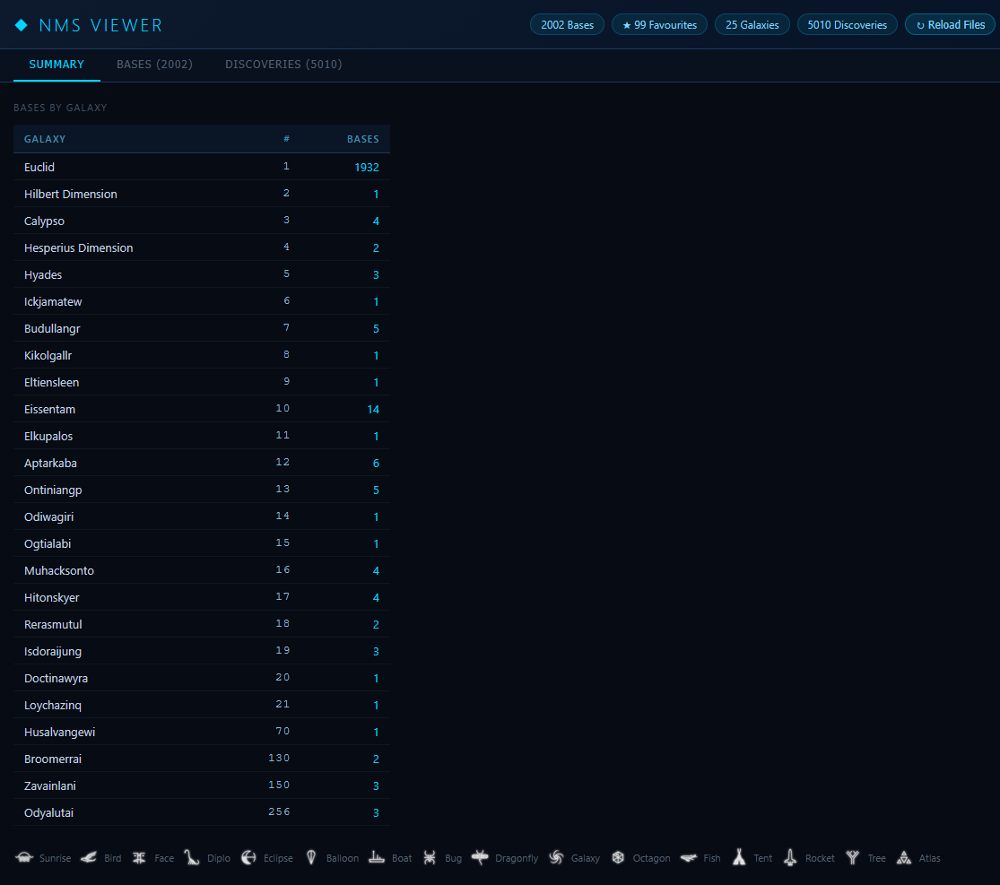
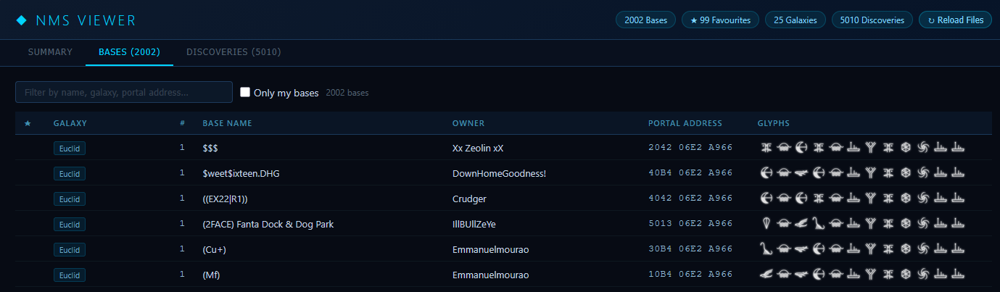
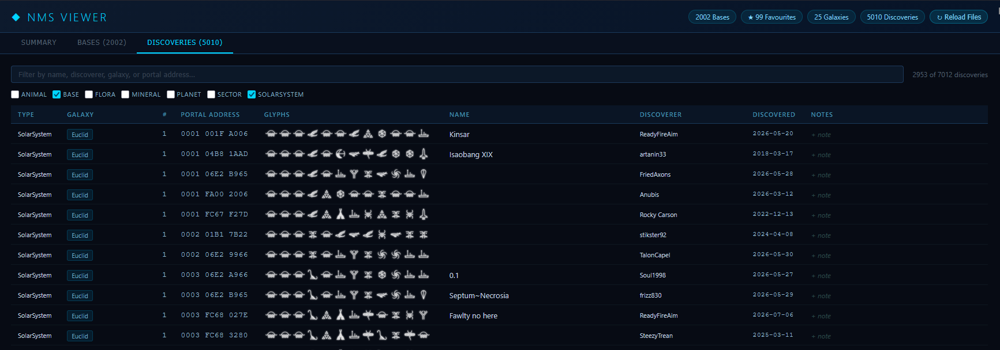

# NMS Viewer

An interactive browser-based viewer for No Man's Sky save data. Displays your bases and discoveries (planets, sectors, solar systems, flora, fauna, minerals) with real NMS portal glyphs, sortable columns, text filtering, and a local notes layer that persists independently of the game save.

Inspired by ebaleytherogue's Python base script.

## Requirements

- Install [uv](https://docs.astral.sh/uv/)
- Use GoatFungus or another NMS save editor to export your save as JSON (in GoatFungus: **Edit → Export JSON**)

## Setup

**First time only** — update uv, create the virtual environment, and install dependencies:

```powershell
uv self update && uv venv --python 3.14 && uv sync --frozen
```

## Adding save files

Place exported JSON files in the `imports/` directory. Name them with a `YYYY-MM-DD` date prefix so they load in chronological order:

```
imports/2026-05-16.json
imports/2026-05-22.json
```

Files without a date prefix are sorted by their modification time on disk and loaded after any dated files. Files whose names start with `.` are also supported.

All files in `imports/` are merged into a local SQLite database (`nms_viewer.db`). Each file is only parsed once — on subsequent runs, files whose modification time hasn't changed are skipped. If data for the same base or discovery appears in multiple exports, the most recent version wins (determined by `LastUpdateTimestamp` for bases, and by data completeness for discoveries).

## Running the app

```powershell
uv run nms_viewer.py
```

Then open **http://localhost:5000** in your browser. (If port 5000 is in use the app will pick another — check the terminal output.)

All console output is also written to a timestamped log file in `logs/` so you can review previous import runs.

On startup the console shows each file's status. Already-processed files are skipped instantly; new or changed files are parsed and written to the database:

```
--- 2026-05-16.json [cached] ---

--- 2026-05-22.json ---
  Bases: 14  Planets: 102  Sectors: 19  Solar Systems: 47
  BASE [NEW]: 'X22: Itamari XII: *** S class west 900u' | 10B4 06E2 A966
  BASE [UPD]: 'X22: Miryush: * Dioxite S' | 20A4 06E2 A966
  NEW Planet: Ayphos Sigma | 1024 AB23 456C | Euclid | ReadyFireAim

=== TOTALS ===
  Bases: 14  Planets: 102  Sectors: 19  Solar Systems: 47
  Named systems: 12  Unnamed systems: 35
```

### Force-reloading files

The **↻ Reload Files** button in the top bar clears the file-processed cache and re-reads all imports from scratch. Use this after adding new files mid-session. All user-entered names and notes are preserved — only the JSON-sourced fields are refreshed.

## Features

### Summary tab
- Count of bases per galaxy with galaxy name and human-readable galaxy number
- Glyph legend showing all 16 NMS portal symbols with their names


### Bases tab
- All player bases with galaxy, base name, owner (player username), portal address, and rendered glyphs
- `PlayerShipBase` and `FreighterBase` entries are excluded automatically
- **Only my bases** checkbox — filters to show only bases owned by your primary account (determined automatically as the most common owner across all bases)
- Text filter — searches across name, owner, portal address, and galaxy
- Click any column header to sort; click again to reverse
- **Editable names**: click any name cell to enter a custom display name. Press Enter or click away to save; Escape to cancel. Your name is stored locally and persists across imports without affecting the JSON-sourced name
- **Notes**: each row has a notes cell — click to add free-text notes that persist in the database


### Discoveries tab
- All discoveries decoded from `DiscoveryManagerData` in the save file
- Types: Planet, Sector, SolarSystem, Animal, Flora, Mineral
- Defaults to showing **Solar Systems only** — use the type checkboxes to add or remove types
- Text filter searches across name, discoverer, galaxy, and portal address
- **Editable names**: click any name cell to edit it; persists locally independent of the save
- **Notes**: per-discovery notes that persist in the database
- **Discoverer**: shown from the save file (`OWS.USN`). If blank for a record, resolved automatically by looking up the player's UID in the player table built from other records in the same or other imports


## Player tracking

As JSON files are imported the app builds a UID → username (`USN`) table from all base owner and discoverer records encountered. This table is used to:
- Fill in missing discoverer names in the Discoveries tab
- Populate the Owner column in the Bases tab

## Portal address format

Addresses are displayed as three groups of 4 hex digits (`PSSS YYZZ ZXXX`):

| Segment | Digits | Meaning |
|---------|--------|---------|
| P       | 1      | Planet index |
| SSS     | 3      | System index |
| YY      | 2      | Voxel Y coordinate |
| ZZZ     | 3      | Voxel Z coordinate |
| XXX     | 3      | Voxel X coordinate |

Sorting by Portal Address sorts by **system index first**, then planet, then voxel coordinates — the display order matches what you copy into a portal decoder.

Multiple bases can share the same portal address (same solar system, different planets or locations). They are distinguished by their world position (`LastUpdateTimestamp` picks which name to keep when the same physical location appears in multiple exports).

## Getting discovery names into the save

NMS does not store procedurally generated names — it fetches them from its servers at runtime. The only names that appear in the save (and therefore here) are ones you have explicitly confirmed in-game:

1. Go to **Discoveries → Visited Systems**
2. Click on a system, hit **Rename**, and accept (no need to change anything)
3. That name is now written to your save and will appear here after the next export

## Files

| File | Purpose |
|------|---------|
| `nms_viewer.py` | Flask server — file processing, routes, name/notes API |
| `db.py` | SQLite layer — schema, upserts, queries, user-edit updates |
| `extract_nms_bases_v8.py` | Save file parser — bases, discoveries, portal decoding, galaxy names |
| `templates/index.html` | Single-page UI — tabs, filtering, sorting, inline editing, glyph rendering |
| `static/glyphs/glyph_0.png` … `glyph_F.png` | NMS portal glyph images |
| `imports/` | Drop your exported JSON save files here |
| `nms_viewer.db` | SQLite database (auto-created on first run, not in git) |
| `logs/` | Timestamped log files from each server run (not in git) |


```
